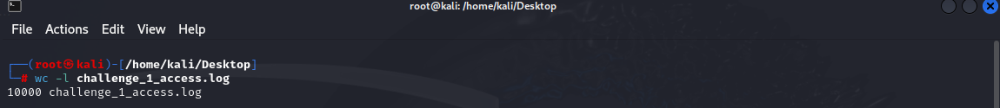

Ici on nous demande le nombre total d'enregistrement, en d'autres mots le nombre de lignes dans le fichier.

sous linux via la commande wc -l challenge_1_access.log nos obtenons le nombre de lignes.

