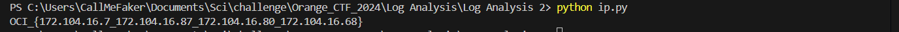

Dans ce challenge, nous avons en notre possession un fichier log non labelisé à travers lequel nous devons chercher les adresses IP qui reviennent le plus fréquemment.

L'objectif est de donner le top 4.

Pour ce faire, je vais utiliser un script Python pour séparer les adresses IP des autres informations, et ensuite faire un cumul sur l'apparition des adresses IP en fonction des 10000 lignes d'enregistrement.

