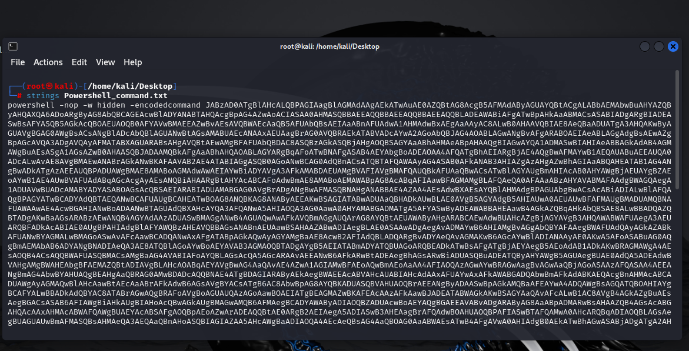
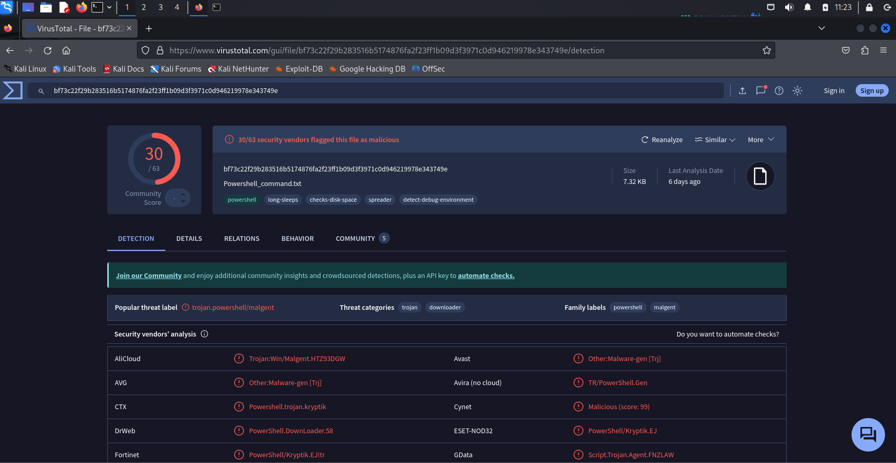
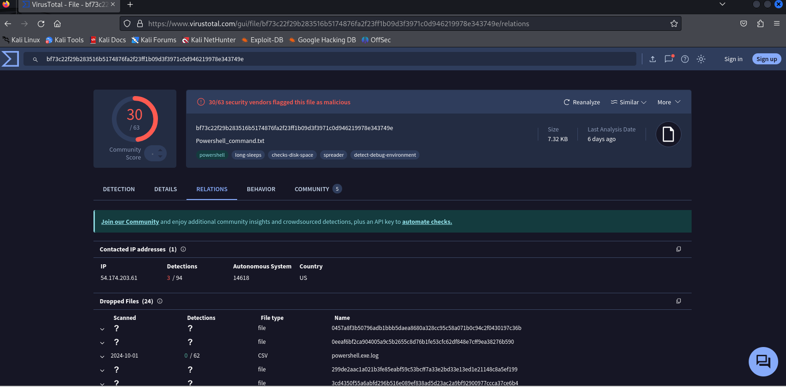

Assurer vous d'ouvrir le fichier sur une machine linux car windows le supprimera automatiquement si vous cherchez à voir le contenu.

Après avoir uploader le fichier sur votre VM , nous chercherons à analyser le contenu avec strings ou cat.

Au niveau du résultat nous constatons qu'il a un script powershell obfusqué qui va s'exécuter en arrière plan.

En voyant l'emploi de la commande -encodedcommand, cela devrait nous mettre la puce à l'oreille que ça peut être quelque chose de malveillant.
Donc nous analyserons le fichier sur virustotal pour avoir assez d'informations

Nous constatons effectivement que le fichier est malveillant, allons dans la section relation pour voir s'il contacte une adresse ip distante

Aux niveaux des relations , une adresse ip unique 54.174.203.61 provient de United States.

Nous pouvons donc en conclure que c'est l'adresse de notre attaquant.
