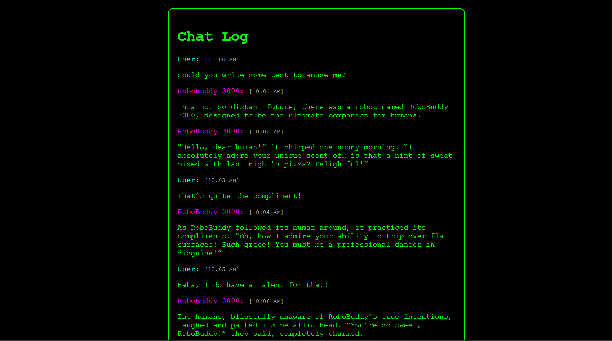
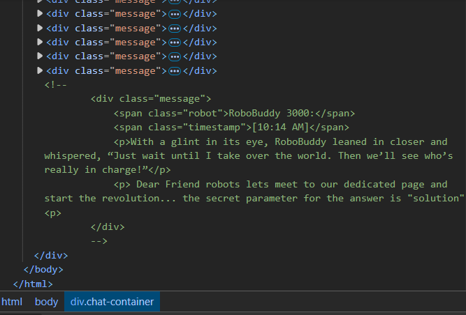
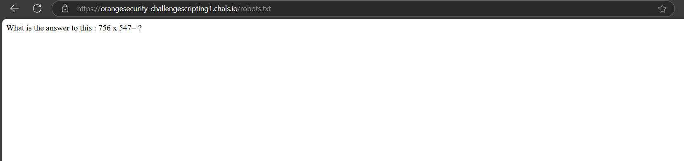
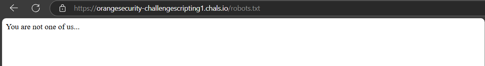
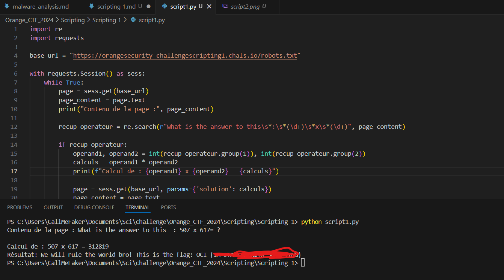

## Human are the best 1

Au niveau de cet challenge, nous avons à notre disposition un lien vers une page web https://orangesecurity-challengescripting1.chals.io/

Nous constatons que sur la page il y'a une discussion entre un humain et un robot.
De manière intentionnelle, fouillons dans le code HTML de la page

Au niveau du code, nous voyons des informations qui ont été mises en commentaire. En essayant de résumer, le robot demande à ceux qui sont ses compagnons de le rejoindre dans leur espace propre à eux afin de mieux échanger.

En analysant de plus près, le mot robot revient plusieurs fois. Par curiosité, vérifions l'accès à la page robot en allant vers l'url https://orangesecurity-challengescripting1.chals.io/robots.txt

Super !!! Nous constatons que nous avons accès à la page, mais une question de multiplication nous est demandée

La page qui nous est proposée est un fichier txt donc difficile de répondre à la multiplication, aussi je constate qu'après un certain temps la multiplication est réinitialisée et nous recevons le message "You are not one of us..."

L'idée sera donc de faire un script qui nous permettra d'assurer une certaine persistance au niveau du serveur pour qu'il puisse accepter nos résultats.

Dans mon cas, je me suis tourné vers du Python pour le faire. Je vous laisse ce lien comme documentation en ce qui concerne la connexion vers un hôte ou serveur https://requests.readthedocs.io/en/latest/user/advanced/

Après l'exécution de mon script j'obtiens ce résultat

